# How to collaborate with git
## Invitation of Team mates (Only one of the teammates need to do it)

1. Ask for the username of the person you're inviting as a collaborator.  
2. Open your browser and go to your github account. Open the repository that you created with the homework.  eg. https://github.com/neslihankeskin/Nesli-RediSchool-Project
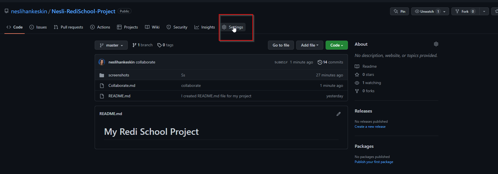

2. Under your repository name, click Settings. In the left sidebar, click Collaborators. (Note: if you do not see the collaborators, then because you repository was set as a private)

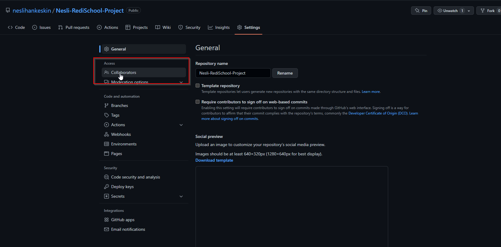

3. Under Manage access, click add people and type your collaborator’s github username.


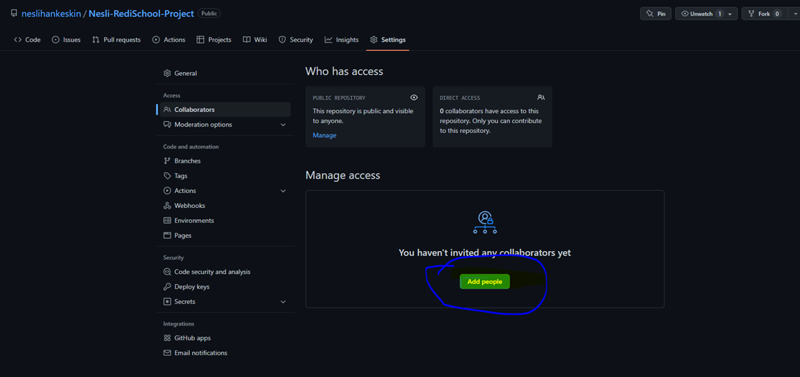
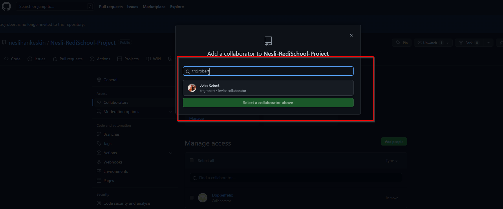
4. Select the collaborator's username from the drop-down menu. Click Add collaborator.
5. Afterwards, you will see the status of your invitation.

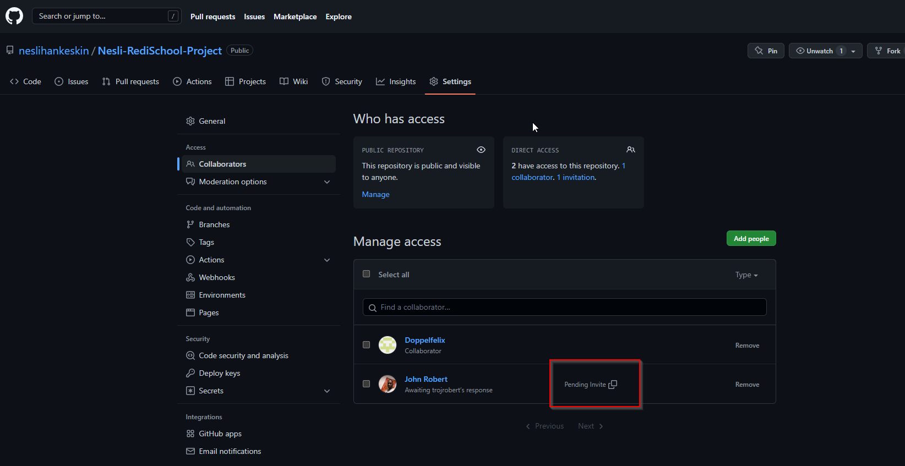

6. The user will receive an email inviting them to the repository. Once they accept your invitation, they will have collaborator access to your repository.
## How to open a Pull request
1. Clone the repository to your system (using your Ubuntu Terminal)

```git clone https://github.com/<USERNAME>/<REPOSITORY_NAME>.git```

2. Create a new branch and create a new markdown file and called it something like "YOURNAME.md". Add some information into, using the markdown syntax. For more info on it check out this [link](https://github.com/adam-p/markdown-here/wiki/Markdown-Cheatsheet).

``` 
cd <REPOSITORY_NAME>
git checkout -b <NEW_BRANCH>
```

After you are done editing your new file, proceed with the usual git steps.

```
git add .
git commit -m "Adding new markdown file"
```
3. Now you can push your code to Github. If you push for the first time your new branch, you need to set up the upstream, as described by git. Git will also provide you with a link to open a Pull Request (PR).
```
git push
(git push --set-upstream origin <NEW_BRANCH>)
```
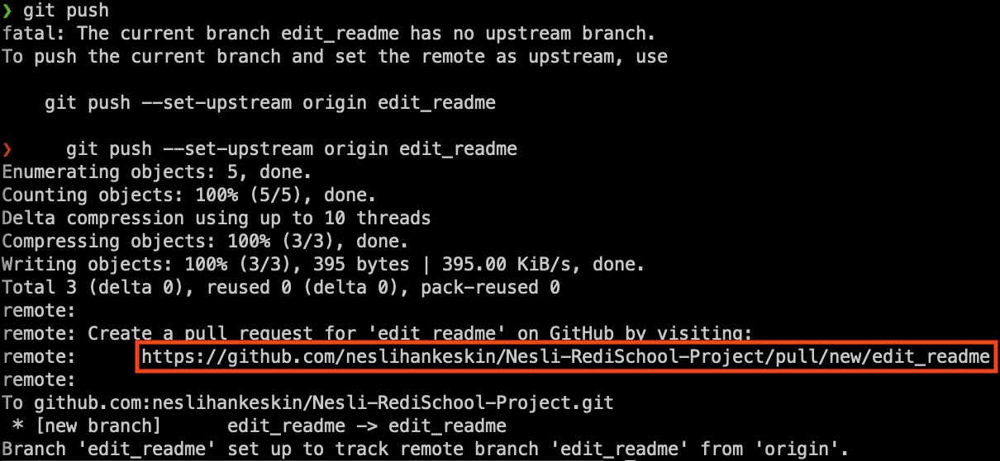

4. Open the pull request

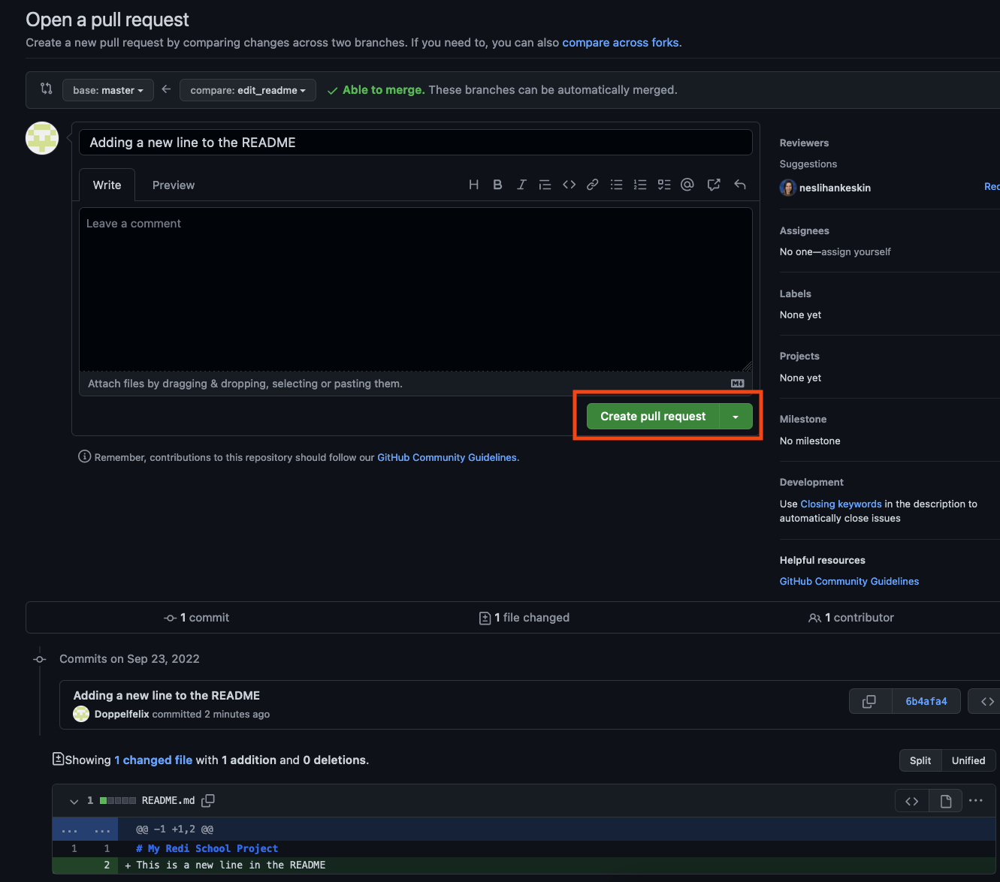

5. Request a review from your team mate

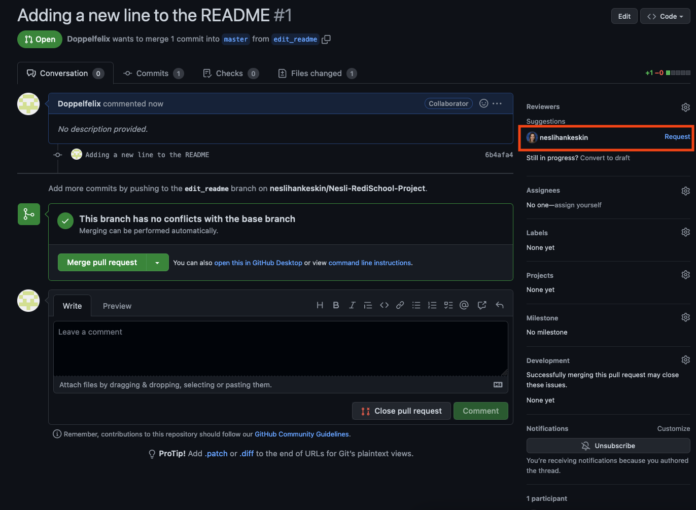

## Review a Pull Request
1. If your teammate requested your review on of their Pull Requests, you can open it via the email link which you should have received. Another way is to open the list of the pull request and select the correct one. You never review your own pull requests, this needs to be done by somebody else!

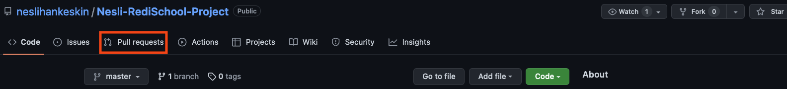

2. Go to "Files changed" and review the code your class mate has written. You can also leave comments.

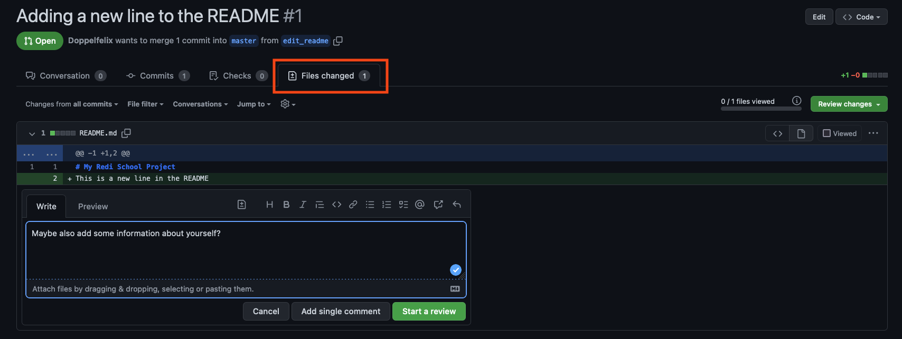

3. When you are done reviewing and your classmate fixed the problems, you can approve the pull request.

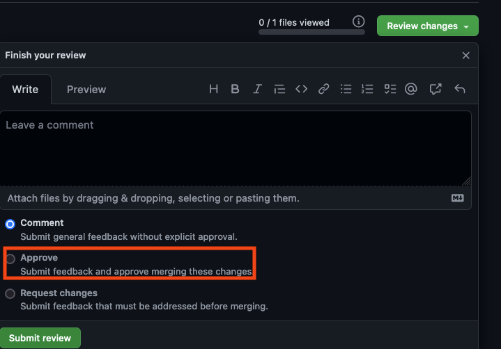

## Merge the Pull Request
1. After a pull request has been approved it can be merged.
The person who opened the pull request should generally always be the person, who merges it. 

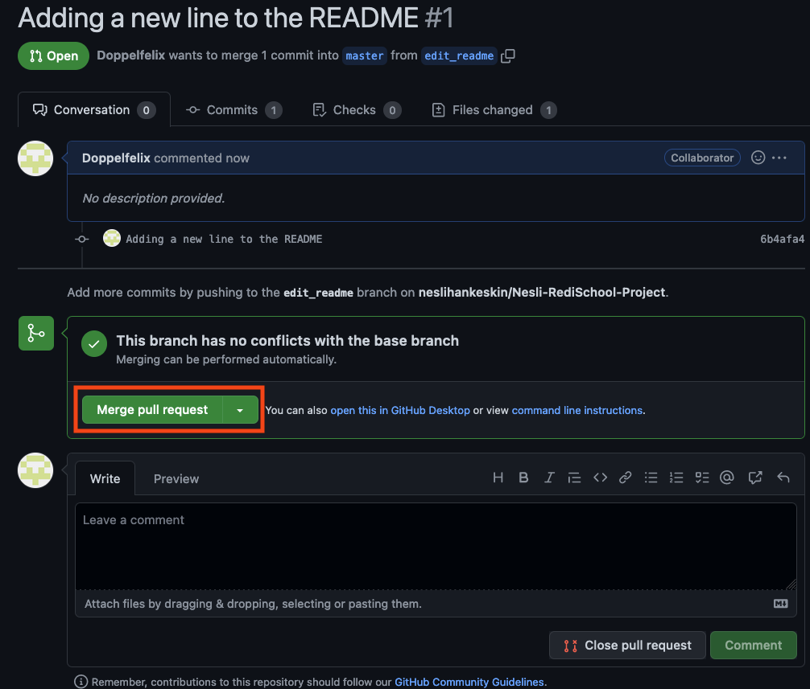
